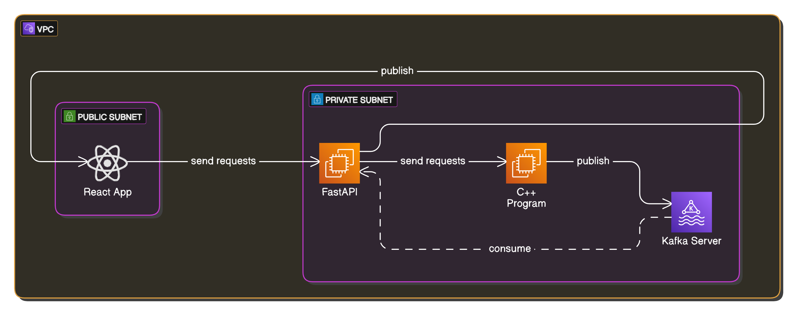

# Orbital Mechanics:

On-going project designed to showcase a full Software Development Lifecyle. At present I am focusing on the local development, using C++ 17 to run the computationally intensive nbody simulation. I'm building a light weight wrapper build in crow to act as a simple interface for the simulation. 

The simulation will publish to a Kafka topic, of which a python Fast API will be the consumer. I have chosen to use a Kafka stream to allow the front end user to recieve data in near real time. The react front end will interface directly with the Python Fast API, acting as both a proxy, and a more easily extensible interface into other parts of the application that may come downstream. 

## Physx:

### Dependencies:
- C++: 17
- CMake: 3.10
- [Crow](https://github.com/CrowCpp/Crow): 1.2.0
- [Asio](https://github.com/chriskohlhoff/asio/tree/asio-1-17-0): 1.17.0
- [GTest](https://github.com/google/googletest/releases/tag/v1.15.2): 1.15.2

A simple physics engine written that models the two body problem using Newtonian Physics. 

## Boot Services:
I use a RaspberryPi 4 to act as a custom CI/CD server, the boot services highlight systmd processes that are set to start on boot, and to re-start after crash. This ensures that the github actions runner process is always active an listening with minimal setup. Using this setup gives me more control over the deployment environment.